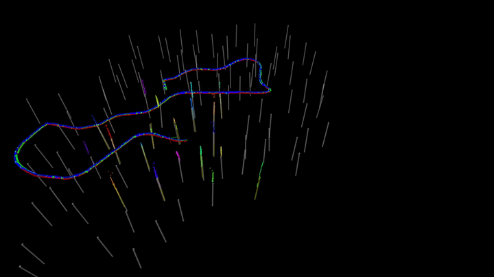
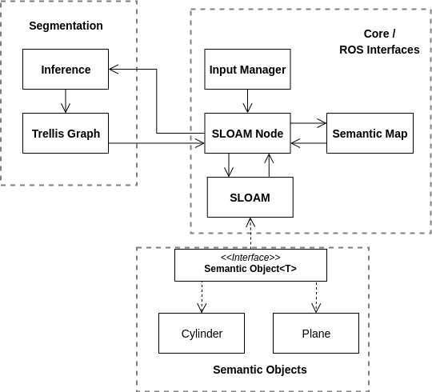

# Semantic Lidar Odometry and Mapping in Forests (SLOAM)

<p align='center'>
    
</p> 

-----------------------

## Setup a worskpace

Even though we recommend using docker to run SLOAM, we decided to keep the ROS workspace on the host machine and create a volume that maps the folder to the container. This way, we can discard the container once the execution stops, but also keep a cached version of the last compilation.
To do this, we will need a worskpace with the following structure on your host machine:

```
sloam_ws/
  -> src/
      -> sloam (folder from this repo)
      -> sloam_msgs (folder from this repo)
      -> models (you have to create this)
```

## Segmentation

You will also need a neural network model for tree segmentation. You can find the ones we used for pine trees [here](https://drive.google.com/drive/folders/1RjuANtrhq0mfgWYKIFZWIriCozDq-Wc3?usp=sharing) (we used the same model in real world and simulated experiments). Download the model and put it in the `models` folder.

We used [RangeNet++](https://github.com/PRBonn/lidar-bonnetal) for segmentation. The trained model needs to be exported to ONNX format. Depending on your inputs/architecture you may need to change the file `sloam/src/segmentation/inference.cpp`. You may also need to change the `seg_model_path` in the file `sloam/params/sloam.yaml` to point to the trained model.

## Docker Image

To build the Docker image locally, you can use the `docker/build_sloam_image.sh` script. This will create an image named `sloam/runtime`. **WARNING** we use multi-stage build to make sure the runtime image is as small as possible, but rebuilding the image will create an auxiliary image that is 26GB+.

Alternatively, you can download the built image from [Docker hub](https://hub.docker.com/repository/docker/gnardari/sloam)

```
docker pull gnardari/sloam:runtime
```


## Running the container

Now that you configured the workspace, it is time to configure the run script `sloam/docker/run_sloam_container.sh`.

You will have to change the variable in the first line of the file to where you created the workspace on your host machine and map a folder where you will put ROS bag files that will be accessed by the container:

```
# Example
SLOAMWS="$HOME/ros/sloam_ws"
BAGS_DIR="$HOME/bags"
```

Also check if the image name in the `docker run` command matches the image you built/downloaded. 

Once inside the container, you can use TMUX to create many terminal windows with `tmux`.

Make sure that the Docker volume mapping the host workspace to the container is working by running `cd /opt/sloam_ws/ && ls src`. This directory should not be empty.

## Local Installation

Instead of Docker, you can install all dependencies locally to run SLOAM. Please refer to the [local installation README](./doc/local_installation.md) for instructions.

## Build workspace

```
 cd /path/to/sloam_ws/
 catkin build -DCMAKE_BUILD_TYPE=Release
```

## Starting the SLOAM Node

The launch file `sloam/launch/sloam.launch` contains the SLOAM parameters that you can tune. You can start SLOAM using the `run.launch` file for real world data (you may need to configure some parameters depending on your sensor) or use `run_sim.launch` to run SLOAM with simulated data. You can download an example bag [here](https://drive.google.com/drive/folders/1RjuANtrhq0mfgWYKIFZWIriCozDq-Wc3?usp=sharing). 

```
tmux
source devel/setup.bash
roslaunch sloam run_sim.launch # running sloam with sim data
ctrl+b % # create new TMUX pannel
cd ../bags/
rosbag play example.bag # play bag
```

## Odometry Backbone
This version of SLOAM requires an odometry backbone to receive an initial guess for pose estimation. The bags we provided will have odometry messages, but for custom data, you will need to run another state estimation algorithm that will be used as an initial guess. Check out [LLOL](https://github.com/versatran01/llol) for a lidar odometry backbone and [MSCKF](https://github.com/KumarRobotics/msckf_vio) for a stereo VIO option.

## Parameter Tuning

Most of the SLOAM parameters can be viewed in the `sloam/launch/sloam.launch` file. There are also the `run.launch` and `run_sim.launch` files where you should define the lidar point cloud and odometry topics, but can be used to change other parameters specifically for your scenario.

# Development

## Code Structure

Here is a high level diagram of the code structure.

<p align='left'>
    
</p> 

- `Input Manager` will listen for Odometry and Point Cloud data and call SLOAM once the odometry estimated that the robot moved `minOdomDistance` from the previous keyframe.
- `SLOAM Node` is the central piece that will call other parts of the code and publish the outputs.
- `Inference` will run the neural network and create two new point clouds with points labeled as trees and another with points labeled as background. 
- `Trellis Graph` uses the tree point cloud to detect individual trees.
- `SLOAM` will receive individual tree detections, the submap of landmarks, the background cloud, plus the initial guess from the odometry. It will filter ground points using heuristics, estimate the semantic objects, perform data association, and pose estimation.
- The results are added to the semantic map and published by the `SLOAM Node`.

## Adding new dependencies to the image
The idea here is that container should be disposable. That means that changes made to the container will not be saved. Intead, you should change `SLOAMDockerfile` to install/change things in the image and rebuild it.
Usually my development workflow is to run the commands inside the current version of the container to make sure it will work then add them to the build file.

## Building the image

The script `build_sloam_image.sh` will take care of building everything. This file performs a two-stage build, where first we compile the C++ packages SLOAM depends on, and then we copy the built libraries to the `runtime` image. The `BaseDockerfile` will contain dependencies and configurations shared between the two stages.

```
./build_sloam_image.sh
```

## Debugging

I recommed VSCode as your editor since it has some nice features to interface with Docker containers and ROS. If you do use it, install the plugin `vscode-ros` (just search for ROS on the plugin tab), `Docker` and `Remote-Containers` to access files and debug your code while running ROS nodes inside a Docker container.

Example debug config:

```
{
  "version": "0.2.0",
  "configurations": [{
      "name": "Node SLOAM",
      "request": "launch",
      "target": "/opt/sloam_ws/src/sloam/sloam/launch/run_sim.launch",
      "type": "ros"
  }]
}
```

In VSCode there will be an option on the left menu called `Remote Explorer`. Click it and choose your container. This will open a new VSCode window with acess to the files inside the container (including the ones that are being mapped from your local computer using a volume). If you don't have a debug launch file yet, open the launch file you are going to run and then go to the `Debug` tab also on the left menu. There will be an option `create json config file`. Once it is created, you can start debugging by running this file from the GUI.

Don't forget to compile with the cmake debug flag if that last compilation wasn't with this flag:
```
 catkin build -DCMAKE_BUILD_TYPE=Debug
```
-------------------
## Citing our work
```
@inproceedings{chen2019,
title={SLOAM: Semantic lidar odometry and mapping for forest inventory},
author={Chen, Steven W and Nardari, Guilherme V and Lee, Elijah S and Qu, Chao and Liu, Xu and Romero, Roseli Ap Francelin and Kumar, Vijay},
booktitle={IEEE Robotics and Automation Letters (RA-L)},
year={2020}
}
```

```
@inproceedings{liu2022large,
title={Large-scale Autonomous Flight with Real-time Semantic SLAM under Dense Forest Canopy},
author={Liu, Xu and Nardari, Guilherme V and Ojeda, Fernando Cladera and Tao, Yuezhan and Zhou, Alex and Donnelly, Thomas and Qu, Chao and Chen, Steven W and Romero, Roseli AF and Taylor, Camillo J and others},
journal={IEEE Robotics and Automation Letters (RA-L)},
year={2022}
}
```
